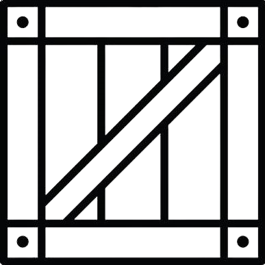

# SokIOban

SokIOban est un jeu en deux dimensions où le joueur doit placer des caisses sur des cases cibles. 
Il peut se déplacer dans les quatre directions et pousser une seule caisse à la fois. 
Une fois toutes les caisses sur les boutons, le niveau est réussi et le joueur passe au niveau suivant. 
L'objectif est de réussir avec le moins de coups possibles.

## Organisation des fichiers

L'organisation des fichiers est la suivante.

- **Sokoban/src** : contient les classes principales du jeu
- **Sokoban/data/assets** : contient les images utilisées pour le jeu
- **Sokoban/data/musics** : contient les musiques utilisées pour le jeu
- **Sokoban/data/levels** : contient les fichiers .txt des niveaux

## Exécution et démarrage du jeu 

Afin de lancer le jeu, il vous suffit d'exécuter la classe `Main` située dans le dossier `src` du projet : vous apparaîtrez alors dans le menu principal du jeu.

### Comment jouer 

- Après le lancement du jeu, vous pouvez sélectionner le personnage que vous souhaitez incarner : le personnage 0 ou le personnage 1.
- Vous pouvez ensuite choisir le niveau que vous souhaitez résoudre. Par défaut, le niveau 0 (tutoriel) est sélectionné.
- Déplacez le personnage en évitant les pièges et activez les boutons en plaçant les caisses au-dessus.
- Lorsque tous les boutons sont activés, le niveau est réussi et vous passez automatiquement au niveau suivant.
- Vous pouvez à tout moment revenir au menu principal en appuyant sur la touche `ECHAP`.
- Recommencez le niveau afin de trouver la solution optimale.

### Les obstacles

| Nom de l'obstacle | Mur                                                                                | Caisse                                                  | Bouton                                                              | Piège                                                                                                                                                | Case unidirectionnelle                                         |
|-------------------|------------------------------------------------------------------------------------|---------------------------------------------------------|---------------------------------------------------------------------|------------------------------------------------------------------------------------------------------------------------------------------------------|----------------------------------------------------------------|
| Représentation    | Case noire                                                                         |                                 |                                         |                                                                                            |                                 |
| Intéraction       | Le joueur ne peut pas le traverser.   Les caisses ne peuvent pas le traverser. | Le joueur peut les pousser, mais ne peut pas les tirer. | Le joueur doit placer les caisses sur les boutons pour les activer. | Si le joueur marche dessus, il perd le niveau et doit recommencer.   Si une caisse est placée sur un piège, la caisse et le piège sont détruits. | Le joueur ne peut les traverser que dans le sens de la flèche. |

### Commandes 

Déplacements du joueur :
- Aller vers la gauche `◄`
- Aller vers la droite `►`
- Aller vers le haut `▲`
- Aller vers le bas `▼`

Pour recommencer le niveau : `R`

Pour accéder au menu du jeu à partir d'un niveau : `ECHAP`

Utilisez les compteurs pour sélectionner le personnage et le niveau.

> **Tip :** n'oubliez pas d'activer le son afin de profiter de la musique du jeu

## Auteurs

* **HONORÉ Alexandre** p2107949
* **SITHIDEJ Clara** p2101573

